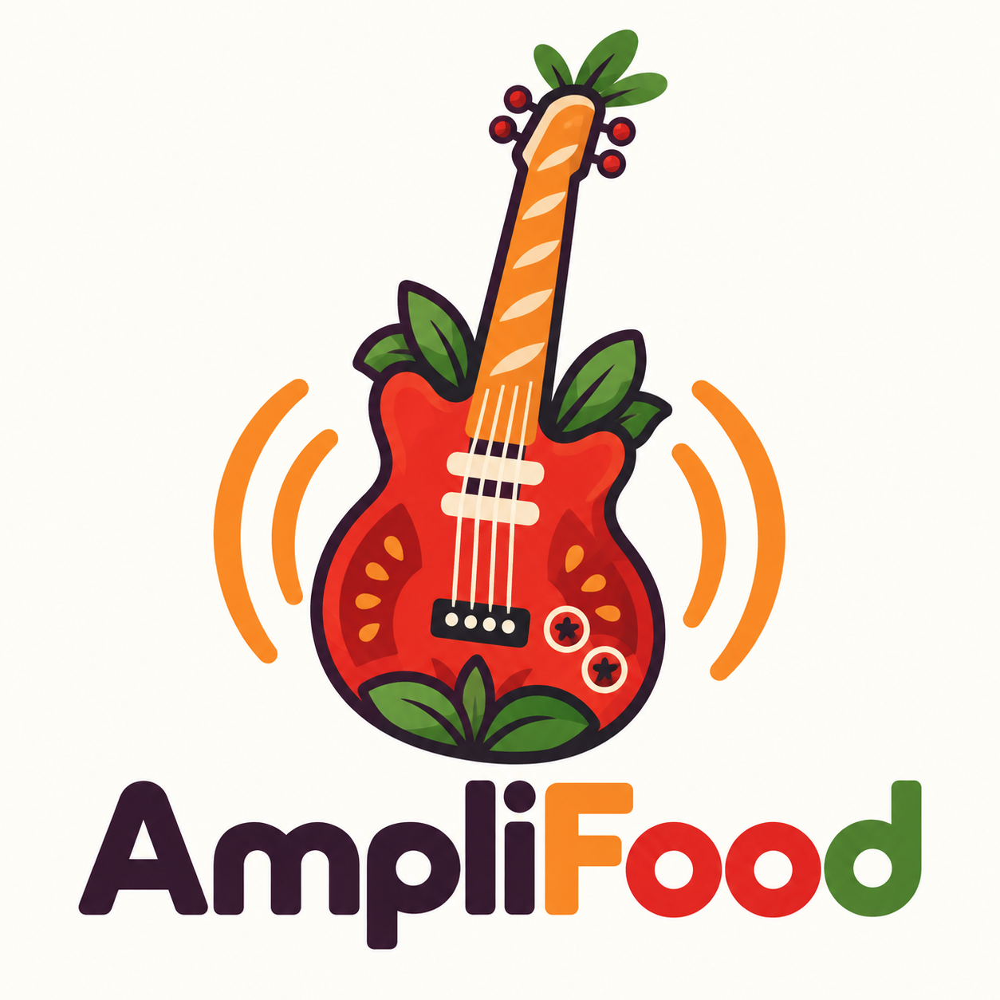

# AmpliFood



Your AI sous chef for real-life cooking: graphic, delicious, warm, and built for busy kitchens. AmpliFood is a cross-platform recipe app built with React Native and Expo, for iOS, Android and the web. Import recipes from social media, plan your meals, manage your pantry, create smart grocery lists, and chat with Ampi or the AI Chef.

## ✨ Features

### 📚 Recipe Management
- **Recipe Book**: Browse and search your entire recipe collection
- **AI-Powered Import**: Parse recipes from text, URLs, or social media posts
- **Smart Search**: Find recipes by name, ingredients, or tags
- **Personal Notes**: Add your own modifications and cooking notes

### 📅 Meal Planning
- **Weekly Calendar**: Plan breakfast, lunch, and dinner for the entire week
- **Visual Planning**: Easy-to-use grid interface showing your meal schedule
- **Quick Navigation**: Move between weeks effortlessly

### 🥫 Pantry Management
- **Barcode Scanning**: Scan product barcodes to add items instantly
- **Manual Entry**: Add items manually with quantity and expiration dates
- **Categorization**: Organize items by category
- **Expiration Tracking**: Keep track of what needs to be used soon

### 🛒 Smart Grocery Lists
- **Auto-Generation**: Create grocery lists from your meal plan with one tap
- **Recipe Attribution**: See which recipe each ingredient is for
- **Check-Off**: Mark items as you shop
- **AI Price Estimator**: Get cost estimates for your grocery haul
- **Store Sections**: Filter items by grocery store section

### 🤖 AI Chef Assistant
- **Multi-Modal Chat**: Ask cooking questions via text, images, or video
- **Pantry Recipes**: Generate recipes based on what you have
- **Detailed Instructions**: Get step-by-step cooking guidance
- **Cooking Tips**: Expert advice on techniques and substitutions

## 🚀 Getting Started

### Prerequisites

- Node.js (v16 or higher)
- npm or yarn
- Expo Go app on your phone (iOS or Android)
- OR iOS Simulator (Mac only) / Android Emulator

### Installation

1. **Clone or navigate to the project directory**
   ```bash
   cd food-dude
   ```

2. **Install dependencies** (already done)
   ```bash
   npm install
   ```

3. **Configure API keys in the app**
   
   Open **Account** and paste your own Anthropic (Claude), OpenAI, xAI (Grok), or Google Gemini key. It is stored on-device in SecureStore (Keychain / Keystore). Do not put provider keys in `.env` — `EXPO_PUBLIC_*` values are compiled into the JS bundle.

4. **Start the development server**
   ```bash
   npx expo start
   ```

### Running the App

Once the Expo server is running, you have several options:

#### Option 1: Physical Device (Recommended)
1. Install **Expo Go** from the App Store (iOS) or Play Store (Android)
2. Scan the QR code shown in the terminal with your phone's camera (iOS) or Expo Go app (Android)
3. The app will load on your device

#### Option 2: iOS Simulator (Mac only)
1. Install Xcode from the Mac App Store
2. Open Xcode and install iOS Simulator
3. In the Expo terminal, press `i` to open in iOS Simulator

#### Option 3: Android Emulator
1. Install Android Studio
2. Set up an Android Virtual Device (AVD)
3. In the Expo terminal, press `a` to open in Android Emulator

#### Option 4: Web Browser
1. Press `w` in the Expo terminal, or run `npm run web`
2. Data is stored in the browser (SQLite on OPFS). Barcode camera scanning and the share sheet are phone-only; everything else works.
3. To build and host the static site, see [WEB_DEPLOY.md](./WEB_DEPLOY.md):
   ```bash
   npm run build:web && npm run preview:web
   ```

## 📱 App Structure

```
food-dude/
├── App.js                          # Main app entry point
├── app.json                        # Expo configuration
├── src/
│   ├── navigation/
│   │   └── AppNavigator.js         # Bottom tab navigation
│   ├── screens/
│   │   ├── RecipeBookScreen.js     # Recipe library
│   │   ├── MealPlannerScreen.js    # Weekly meal planner
│   │   ├── PantryScreen.js         # Pantry inventory
│   │   ├── GroceryListScreen.js    # Shopping list
│   │   └── AiChefScreen.js         # AI cooking assistant
│   ├── database/
│   │   ├── schema.js               # SQLite database schema
│   │   └── operations.js           # CRUD operations
│   ├── services/
│   │   ├── recipeParser.js         # AI recipe parsing
│   │   ├── aiChefService.js        # Multi-modal AI chef
│   │   ├── barcodeService.js       # Barcode lookup
│   │   └── groceryService.js       # Grocery list generation
│   ├── components/
│   │   └── Brand.js                # Wordmark, logo mark, checkerboard strip
│   ├── platform/                   # Native vs. web shims (camera, share, alert)
│   ├── theme/
│   │   └── index.js                # Design system & colors
│   └── utils/
│       └── dateHelpers.js          # Date utilities
├── assets/brand/                   # Logo sources + generated in-app artwork
├── public/                         # Web index.html, manifest, PWA icons
├── scripts/
│   ├── generate-brand-assets.py    # Rebuild icons/splash/favicon from the logos
│   └── web-postexport.js           # Make dist/ safe for any static host
└── vercel.json                     # Static web hosting config
```

## 🎨 Design System

AmpliFood's palette comes from the logo and the brand mood board:

| Role | Hex |
| --- | --- |
| Burnt orange (primary) | `#EB6A1C` |
| Tomato red | `#E2261F` |
| Butter yellow | `#F6C445` |
| Cream (light background) | `#FBF4E8` |
| Ink black (text, dark background `#1A1216`) | `#2A1424` |
| Garden green (success) | `#4F802F` |

- **Logo system**: the colour food-guitar mark for warm moments (app icon, splash, loading, empty states); the black-and-white mark for small stamps and editorial spots (Account footer, notices).
- **Type**: Fredoka (heavy, rounded) for headers, tab labels and brand moments; the system font for body copy.
- **Pattern**: a small ink checkerboard strip, used sparingly.
- **Dark mode**: automatic, with a cream-on-ink wordmark.
- Regenerate icons and logo art after changing a source logo: `npm run brand:assets` (needs Python with Pillow and NumPy).

## 🔧 Technologies Used

- **React Native** - Cross-platform mobile framework
- **Expo** - Development platform and tooling
- **SQLite** - Local database for offline-first experience
- **Google Gemini AI** - Multi-modal AI for recipe parsing and assistance
- **React Navigation** - Navigation library
- **Expo Camera** - Barcode scanning
- **Open Food Facts API** - Product information database

## 📝 Usage Guide

### Adding Your First Recipe

1. Tap the **Recipes** tab
2. Tap the **+** button
3. Paste a recipe URL or text from Instagram, TikTok, YouTube, etc.
4. The AI will automatically parse ingredients and instructions
5. Review and save

### Planning Your Week

1. Go to the **Planner** tab
2. Navigate to your desired week
3. Tap any meal slot (breakfast, lunch, dinner)
4. Select a recipe from your collection
5. The meal is added to your plan

### Creating a Grocery List

1. Plan your meals for the week
2. Go to the **Grocery** tab
3. Tap "Generate from Meal Plan"
4. AI consolidates all ingredients
5. Check off items as you shop

### Using the AI Chef

1. Go to the **AI Chef** tab
2. Tap "Recipe from Pantry" to generate recipes from your ingredients
3. Or ask any cooking question in the chat
4. Upload images of ingredients for identification
5. Get detailed cooking instructions and tips

## 🔐 Privacy & Data

AmpliFood is a Bring Your Own Key app. Your data stays on this device. API keys are stored in the OS encrypted keychain. Recipes, pantry, and preferences live in a local database that never leaves your phone.

- **Local storage**: Profile, recipes, pantry, and preferences live in on-device SQLite. Theme and UI prefs use AsyncStorage. There is no AmpliFood account server.
- **API keys**: Stored in SecureStore (Keychain / Keystore). Never in the binary, never in SQLite, never on our servers (there are none for keys).
- **No shared keys**: Do not put provider secrets in `.env`. `EXPO_PUBLIC_*` values are compiled into the JS bundle.
- **No tracking**: The app does not collect usage analytics.

Full map: [USER_SAFETY.md](./USER_SAFETY.md). The same disclaimer is shown in **Account**.

## 🐛 Troubleshooting

### "Add an API key in Account" error
- Open Account, pick a provider, paste your key, and save
- Refresh the model list after saving. Pantry, planner, and grocery work without a key.

### Barcode scanner not working
- Grant camera permissions when prompted
- Ensure you're running on a physical device (simulators don't have cameras)

### Database errors
- Clear app data and restart
- On iOS: Delete and reinstall the app
- On Android: Clear app storage in settings

## 🚧 Future Enhancements

- [ ] Cloud sync and backup
- [ ] Recipe sharing with friends
- [ ] Nutrition information tracking
- [ ] Shopping list sharing with household
- [ ] Recipe collections and folders
- [ ] Cooking mode with voice commands
- [ ] Integration with grocery delivery services

## 📄 License

This project is for personal use. Built with ❤️ using React Native and Expo.

## 🙏 Acknowledgments

- **Deglaze App** - Inspiration for features and UX
- **Open Food Facts** - Free product database
- **Google Gemini** - AI capabilities
- **Expo Team** - Amazing development platform

---

**Turn it up in the kitchen with AmpliFood.**
